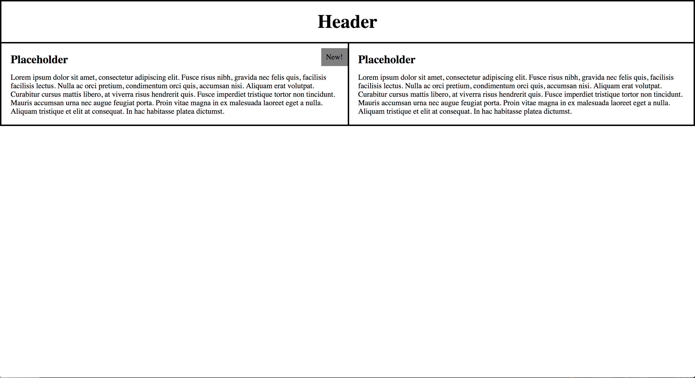
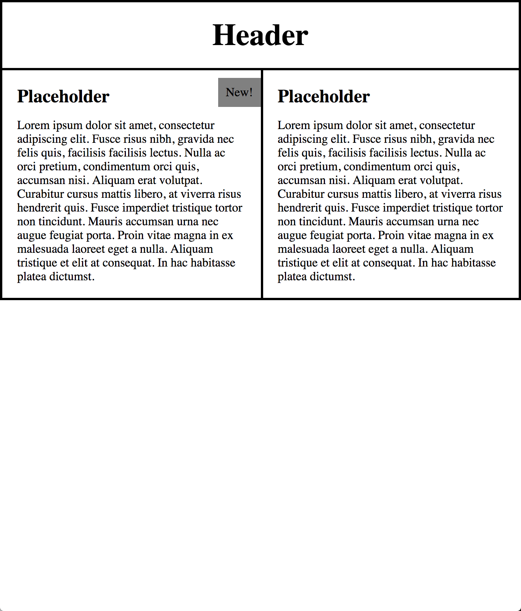

**HTML/CSS mini**
----------------------------------

Topics:
* Box Model
* Flex Box
* BEM Naming Conventions
* Extra Credit: Media Queries

You will be turning the provided wireframe into a page. For your first implementation, use only box model rules. Half way through the allotted time, refactor what you have to use flexbox. Make your second solution on a second branch.

You're provided with an index.html file and a styles.css file to begin with, but you're welcome to restructure as you see fit. The mockups are also in the mockup folder for your reference. The full width version is the first you'll be implementing. The mid and small are for extra credit.

[Box Model Study Guide](https://docs.google.com/document/d/1db_gVHonRIAjozSZ7NFsqghJ5B7gdGWgRF0c-3oIGdA/edit?usp=sharing)

## Extra Credit
  * Make your Box Model solution responsive to browser resizing using media queries.
  * [Media Query Min & Max Width Quick Reference](https://docs.google.com/document/d/15ucW3PUI3mBPq85gUF_TrVmm9W3HM8LZ6VxhZKZdDqE/edit?usp=sharing)

<table>
  <tr>
    <td></td>
    <td></td>
  </tr>
</table>
